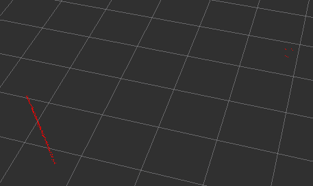
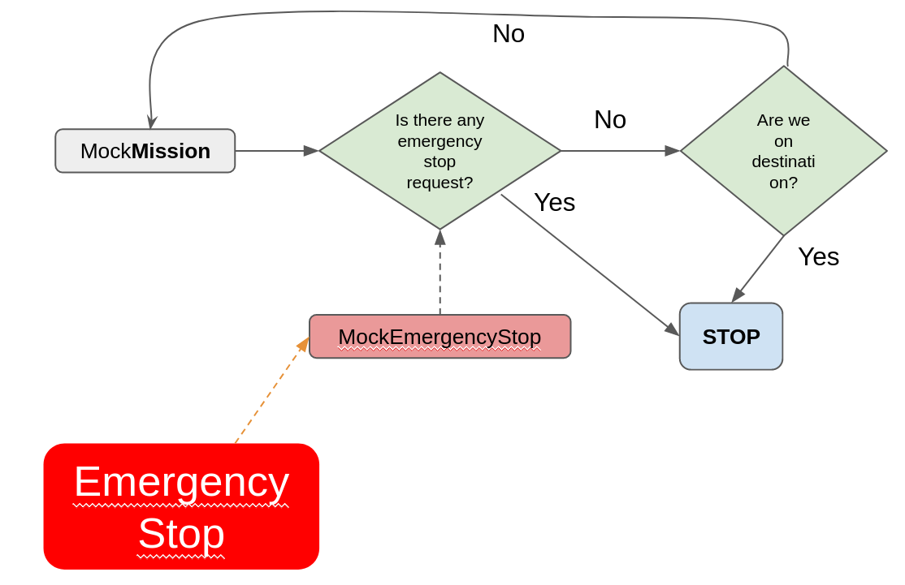
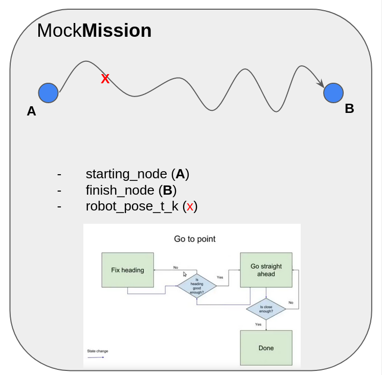

# Preparation

## Prerequisites
- python3

```bash
$ python3 -m venv stop-start-robot-dev
$ source stop-start-robot-dev/bin/activate
$ pip install bokeh bagpy pandas jupyterlab
```

## Usage

The command given below will kick-off the jupyter notebook 

and open an html for further code visualisation.

```bash
$ jupyter-lab
```

## Summary of the Setup

In our experiment we have a differential wheeled robot that equipped with lidar, imu, a wall and another static sensor bot that equipped with lidar to measure the stopping distance of the target_bot. 


# Layout of the experiment!

As one can see from the above Figure, there is a wheeled robot facing a wall and another sensor bot which has the wall and the wheeled robot in its FoV. 



the wheeled robot will be tasked via **MockMission** to follow a straight path toward the wall. In the meantime the robot will be listening any **EmergencyStop** requests. 

Unless any **EmergencyStop** requests have been made or **MockMission** has been achieved the robot will try to correct its yaw and arrive to the desired destination.

The general system architecture can be found below, 



The simplest model of **MockMission**



## To export as html with embedded images

To be able to download a html with embedded images Nbextensions can be quite handy. The following commands do install the package and configure jupyter to enable it.

```bash
$ pip install jupyter_contrib_nbextensions
$ pip install jupyter_nbextensions_configurator
$ jupyter contrib nbextension install --user 
$ jupyter nbextensions_configurator enable --user
```
