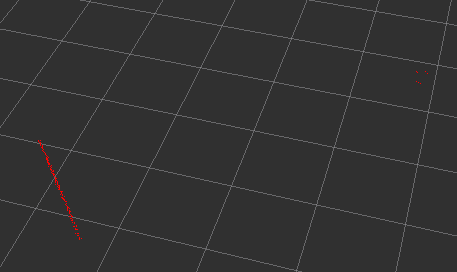
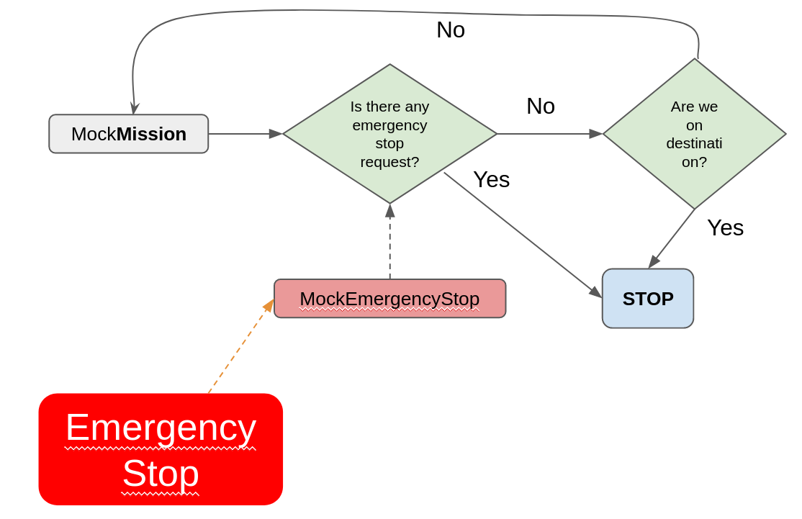
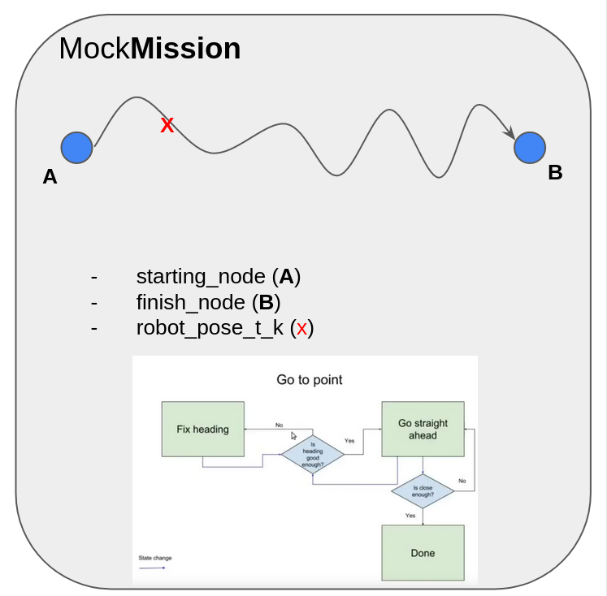

# Melodic mybot_ws on docker

Forked from : [mrkoz/mybot_ws](https://github.com/mrkoz/mybot_ws)

## About

To be able to have reproducible results and easy deployment, I looked for the options where I could build a docker container that contains ROS and Gazebo. The repo given above is basically foundation of the whole simulation part of the project.

## Requirements

* Docker
* Bash
* docker-compose
* Remmina Remote Desktop Client 

## Howto

### To run the container

* In your console type `make up` and wait for the build to finish
* Open a browser to [http://localhost:6080](http://localhost:6080)
* login as `ubuntu:ununtu` in the http vnc client(Remmina `localhost:5900`)
* or ssh to the container on port 222 with `ssh -v -p 2222 ubuntu@localhost`

### Credentials

* id: ubuntu, psw: ubuntu

They can be changed from **docker-compose.yaml**

## Summary of the Setup

In our experiment we have a differential wheeled robot that equipped with lidar, imu, a wall and another static sensor bot that equipped with lidar to measure the stopping distance of the target_bot. 

    

### Layout of the experiment!

As one can see from the above Figure, there is a wheeled robot facing a wall and another sensor bot which has the wall and the wheeled robot in its FoV. 

    

the wheeled robot will be tasked via **MockMission** to follow a straight path toward the wall. In the meantime the robot will be listening any **EmergencyStop** requests. 

Unless any **EmergencyStop** requests have been made or **MockMission** has been achieved the robot will try to correct its yaw and arrive to the desired destination.

The general system architecture can be found below, 

    

The simplest model of **MockMission**

    

## Howto run Experiments

# Funny and Remarkable last notes by the Author

## More detail

Everything is in the Makefile. To get a detailed list type `make` or `make help` and it will say what each make target does.

The makefile is just there to simplify the commands to run the docker container, tweak it to your needs.

## Licence

This is a fork of someone else's work, there is no license except that by using this repo, you agree that the contributors are not at all to blame for any outcomes; good, bad, or otherwise that you may create through the use of this repo.

Especially if you create an army of sentient machines that takes over the world - totally not responsible for that.

## links

* [the video that sparked interest](http://moorerobots.com/blog/post/1)
* [the repo this is forked from](https://github.com/richardw05/mybot_ws)
* [ROS source images from osrf](https://github.com/osrf/docker_images/tree/master/ros/melodic/ubuntu/bionic)
* [A dockerfile that's got some insipirational bits](https://github.com/ChrisTimperley/TurtleBot.Dockerfile/blob/master/source/Dockerfile)
* [Another docker file](https://hub.docker.com/r/ct2034/vnc-ros-kinetic-full/~/dockerfile/)
* [A docker file with VNC in it](https://hub.docker.com/r/dorowu/ubuntu-desktop-lxde-vnc/)

## Credits

Credit goes to:

* the original repo creator [richardw05/mybot_ws](https://github.com/richardw05/mybot_ws)
* the docker people
* the ROS people
* the gazebo people
* my mum
* your mum
* lol
