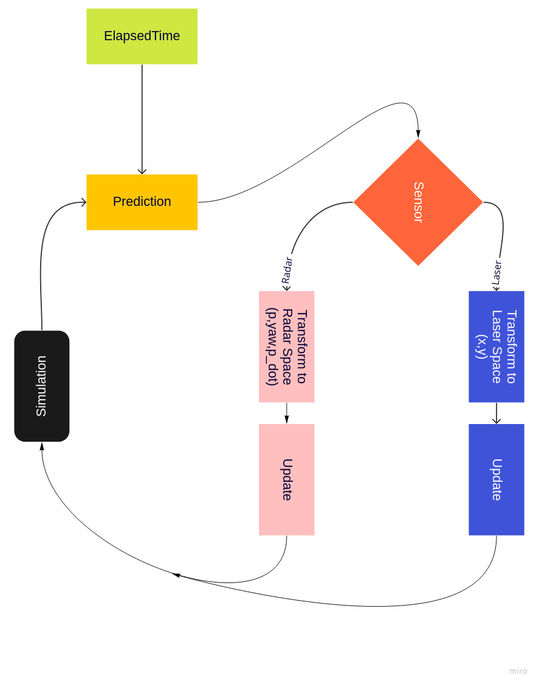

# SFND Final Project (Unscented Kalman Filter)

The final project of Sensor Fusion Nanodegree Program. It implements different bit and pieces of Unscented Kalman Filter to track states of multiple cars on a  highway. Some fairy dust has been added to the measurements to face with real world challenges. The foundation of the code is coming from [sfnd-ukf](https://github.com/udacity/SFND_Unscented_Kalman_Filter).  


# Build instructions

```bash
mkdir build
cd build
cmake ..
make -j8
./ukf_highway
```

# Aim

The project uses Unscented Kalman Filter with environment created by PCL render functions. UKF is implemented as a part of project, and PCL has been used by Udacity to handle rendering of environment, replaying recorded laser and radar data and calculate how accurate the tracking is. 


# Workflow 



- Simulation: The component that implemented by Udacity and it updates position of the tracked vehicle based on the recorded data.
- Prediction: This component implemented as a part of the project by following the course notes provided by Udacity. It is responsible of getting the prior state of the tracked vejoc;e and apply unscented transformation to the state so that motion model of tracked vehicle will be considered. 
- UpdateLaser: This component implemented as a part of the project and basically, it gets the laser measurement and updates the prediction based on the real measurement.
- UpdateRadar: This component implemented as a part of the project and is similar to the UpdateLaser component apart from the transformation step. It requires to transform state to a polar coordinate to do the update. Fortunately, nothing is changing from unscented transformation side. 

# Performance Metrics

There are several parameters has been used as performance metrics. First one is the **Root Mean Square Error(RMSE)** of the tracking, in other words difference between actual vehicle position and predicted position. It is quite useful, but not enough to understand the accuracy of each components described in above section. Second metric has been introduced to measure accuracy of UpdateLaser and UpdateRadar component and the name of this metric is **Normalised Innovation Squared (NIS)**. Basically, it compares the predicted state with actual measurement to validate how good correction steps it is working.

 NIS follows distribution that is called **chi-square**, so that it has been calculated for each step and at the end of the run, each NIS value have been compared to a threshold. The threshold picked up from Chi-square distribution table and it corresponds to the value that it is above 95% of the NIS distribution. The threshold depends on dimension of measurement space, for this reason it is different for laser and radar. (*laser:* 5.991, *radar:*7.815)

# Different Use Case

- Only Radar
    - RMSE: X=1.06, Vx=0.95, Vy=0.59 (After running the simulation for 30sec and all vehicles are tracked)
    - Number of NIS value above the threshold: 
        - Laser: 0/300 (That means the process noise, cause the measurement to overfit)
        - Radar: 0/300 (That means the process noise, cause the measurement to overfit) 

- Only Laser
    - RMSE: Vx=1.20, Vy=0.70 (After running the simulation for 30sec and all vehicles are tracked)
    - Number of NIS value above the threshold: 
        - Laser: 113/300 (That means the process noise, cause the measurement to underfitted)
        - Radar: 82/300 (That means the process noise, cause the measurement to underfitted) 


- Laser & Radar
   - RMSE: Y=0.35 (After running the simulation for 30sec and all vehicles are tracked)
    - Number of NIS value above the threshold: 
        - Laser: 39/300 (That means the process noise, cause the measurement to underfitted)
        - Radar: 19/300 (That means the process noise, cause the measurement to underfitted) 

As one can see, radar is worse with estimating position of the vehicle, on the other hand laser struggles with estimating velocity. However, when both is combined and fused the overall performance of the UKF improves significantly and it satisfies one of the Project goals which is keeping the RMSE below the given threshold.


