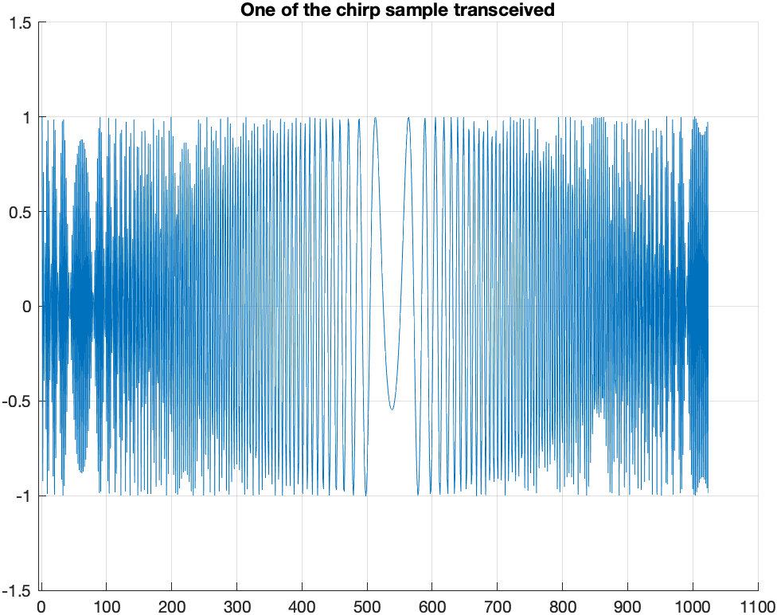
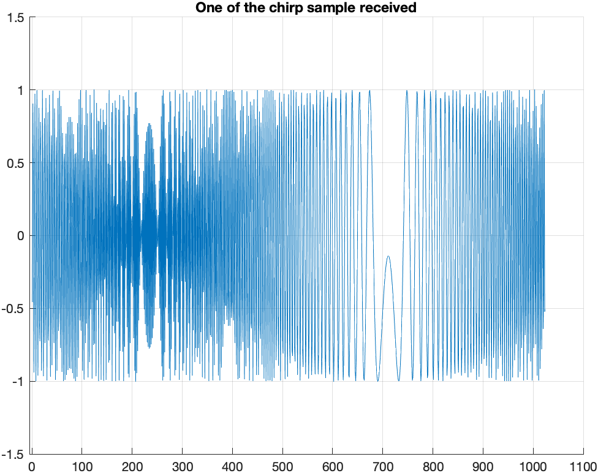
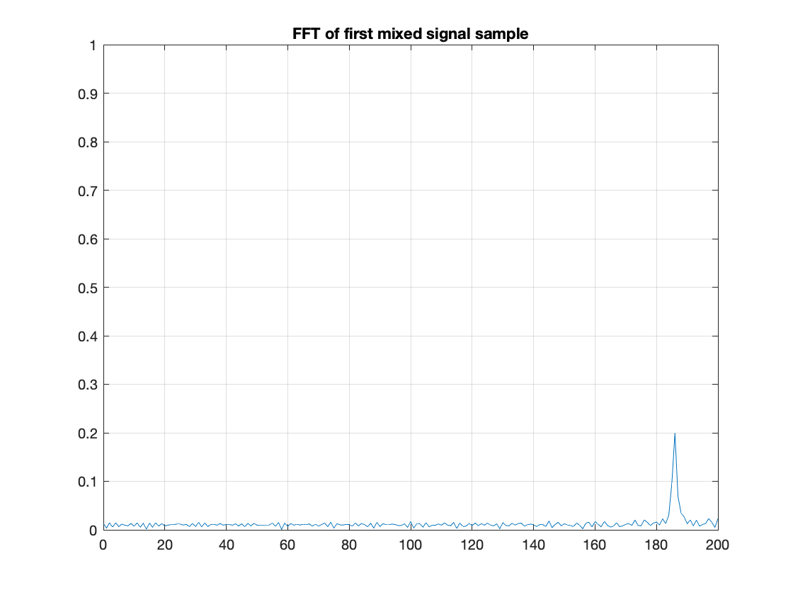
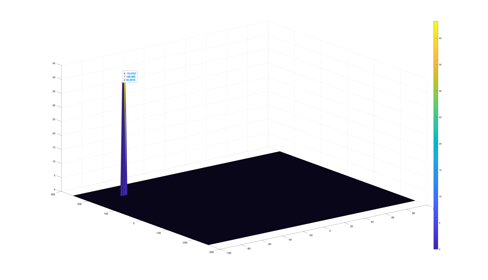

In this project, a radar sensor is simulated and some processings have been done based on the system requirements. 

|  |
|:--:|
| **Figure 1**:  Overal diagram of the radar project|

The overal diagram is summarised with following items:

- Configure the FMCW waveform based on the system requirements.
    
- Define the range and velocity of target and simulate its displacement.
    
- For the same simulation loop process the transmit and receive signal to determine the beat signal
    
- Perform Range FFT on the received signal to determine the Range

- Towards the end, perform the CFAR processing on the output of 2nd FFT to display the target.

# FMCW Waveform Design

In this section, EM signal has been simulated so that the radar sensor behaviour can be 
|  |
|:--:| 
| **Figure 2**: Equations to simulate radar sensor behaviour to detect moving target |

Add the slope information

**Transceived Signal**

|  |
|:--:| 
| **Figure 3**: One of the transceived signal to detect moving target |

**Received Signal**

|  |
|:--:|
| **Figure 4**: One of the received signal to detect moving target |

# FFTs

**Result of Range FFT (1st degree of FFT)**

|  |
|:--:|
| **Figure 5**: Range FFT - 1st degree FFT of mixed signal (beat signal) to calculate distance of the receiding vehicle from the ego vehicle (the initial position was given 185.7) |

# 2D CFAR

|  |
|:--:|
| **Figure 7**: CFAR 2D to filter out clutter noise |

One of the main changes of the radar noise is Clutter noise caused because of road surfaces, retroreflectives and adverse weather conditions. There are various methods t´o get rid of the clutter noise such as static thresholding, dynamic thresholding, etc. In this task, I implemented 2D CFAR (Constant False Alarm Rate) to generated dynmaic threshold to get rid of that unwanted echoes. Shortly, with CFAR, the noise at every or group of range/doppler bins is monitored and the signal is compared to the local noise level. 

The implementation of 2D CFAR consists of some steps such as:

- Traverse on each column for each row (start from Gr+Tr+1 for row, Gc+Tc+1 for column - edge cells)
- Sum each training cell noise level for given cut cell (pass on guard cells)
- Compare the summed/averaged noise level of the training cells to pre-determined noise threshold
- If the noise level is below threshold filter it, else populate it

There two more keypoints about implementation of 2D CFAR. 
- **Values of (Tr, Tc, Gc, Gr)**: Selection of training, guard cells for rows and columns were completely an iterative process that I changed the values until obtained result was similar to given one in the course guideline.
- **Filtering non-thresholded cells, edges**: Before starting to traverse the RDM (Range Doppler Map) a **signal_cfar** object has been created. The edge cells are always zero because they will be never visited. 
```cpp
signal_cfar = zeros(Nr/2,Nd);
```

