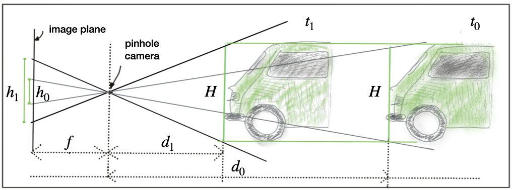
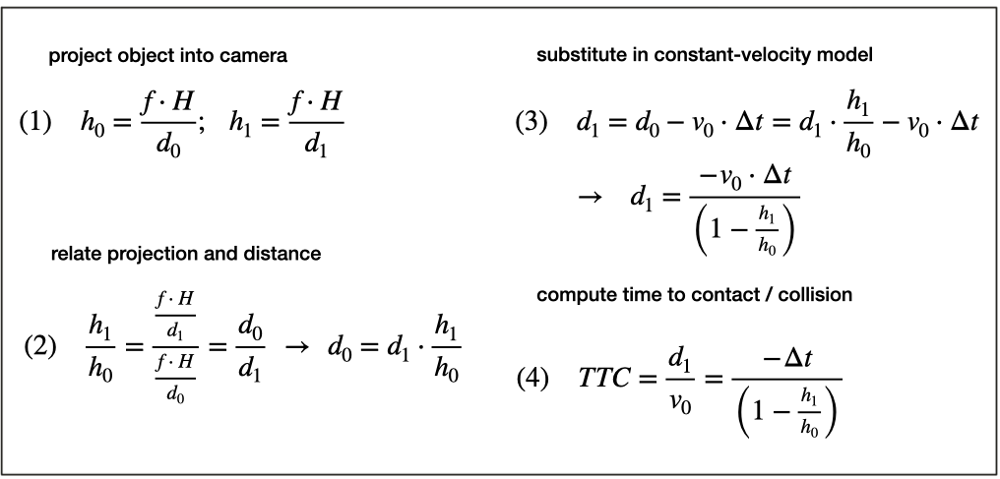
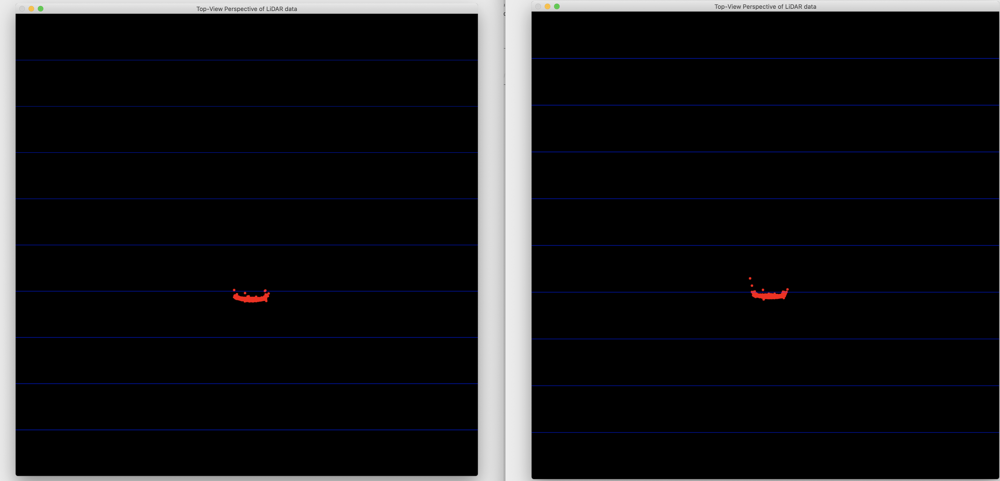
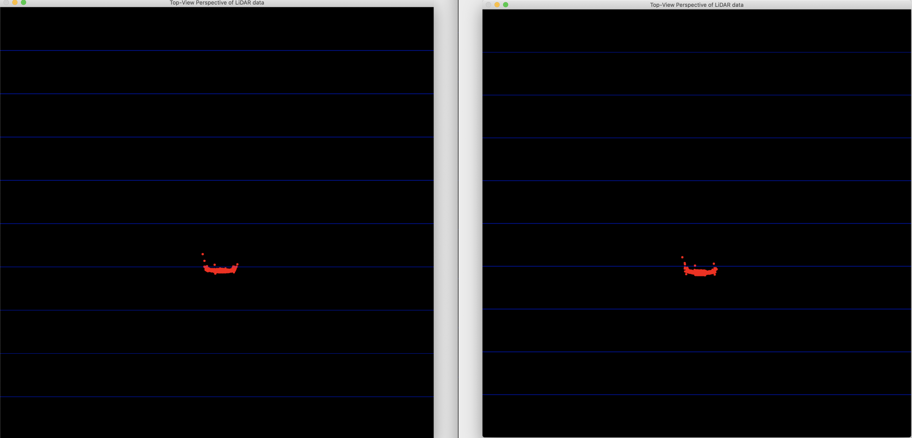
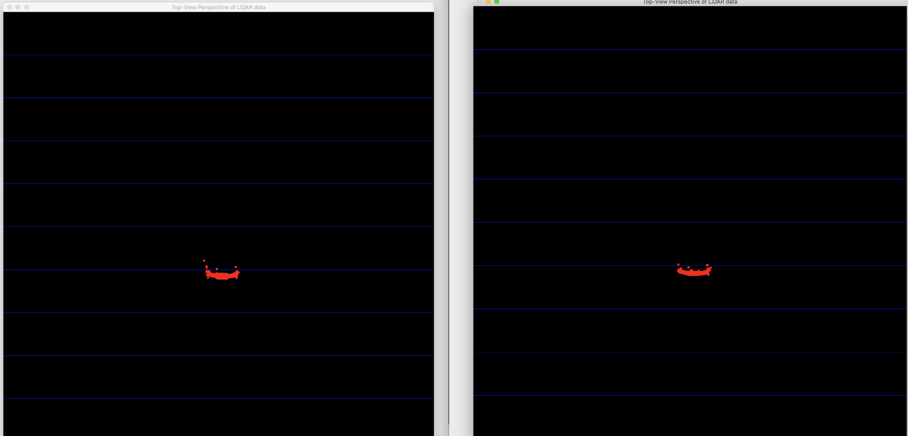
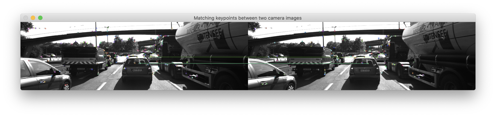

# Track an Object in 3D space 

In this project the purpose is:
- Match correletated bounding boxes for sequential frames, correlation will be based on highest number of keypoint correspondences (FP.1)
- Calculate **Time-to-Collision** based on only lidar measurements/observations and do required filtering for the lidar observations to disregard outliers due to false measurements (FP.2)
- Associate keypoint correspondes to the bounding boxes (FP.3)
- Calculate **Time-to-Collision**  based on only keypoint correspondences from the matched bounding boxes (FP.4)
- 


# FP.1 Match 3D Objects

In this task, bounding boxes have been correlated for sequential frames. To achieve that task **bestMatchedBbStats** has been constructed to keep the number of keypoint correspondences between each bounding box pairs. 

```cpp
// Initialise the stat matrix of best matched bounding box pairs 
std::vector<std::vector<int>> bestMatchedBbStats(numbOfBb_prevFrame,vector<int> (numbOfBb_currFrame, 0));
```

As one can see from above **bestMatchedBbStats** is a 2D vector and it is constructed with a following basic logic:
```cpp
for( auto match : matches){
   auto prevFrameIdx = match.queryIdx;
   auto currFrameIdx = match.trainIdx;
   
   // Find corresponding keypoint among previous frame bounding boxes 
   for(auto prevFrameBbit = prevFrame.boundingBoxes.begin(); prevFrameBbit != prevFrame.boundingBoxes.end(); prevFrameBbit++){
       if(prevFrameBbit->roi.contains(prevFrameKpt[prevFrameIdx].pt)){
            // Find corresponding keypoint among current frame bounding boxes 
           for(auto currFrameBbit = currFrame.boundingBoxes.begin(); currFrameBbit != currFrame.boundingBoxes.end(); currFrameBbit++){
               if(currFrameBbit->roi.contains(currFrameKpt[currFrameIdx].pt)){
                   bestMatchedBbStats[prevFrameBbit->boxID][currFrameBbit->boxID]++;
                  // std::cout << "box id: " << prevFrameBbit->boxID << " " << currFrameBbit->boxID << "\n";
               }
           } 
       }
   }     
} 
```
by querying whether the bounding box contains the match or not. There after only the best candidates have been taken as a result:
```cpp
// Find the pair that has higher number of keypoint correspondence 
for(auto prevFrameBBId = 0; prevFrameBBId < numbOfBb_prevFrame ; prevFrameBBId++){
    auto maxIdx = std::max_element(bestMatchedBbStats[prevFrameBBId].begin(),
                                   bestMatchedBbStats[prevFrameBBId].end()) - bestMatchedBbStats[prevFrameBBId].begin();
    bbBestMatches.insert(std::pair<int,int>(prevFrameBBId,maxIdx));
}
```

# FP.2 Compute Lidar-based TTC

In this task, Time-to-collision (TTC) calculated only based on laser observations. The only challenge of this task was filtering the outliers, so that **lidarFindMinWithOutlierRemoval()** has been implemented to fulfil that given challenge. 

In this function, basically all the lidar pointcloud has been sorted and median of last **statWindow** has been taken to get rid of false positives. 


```cpp
void lidarFindMinWithOutlierRemoval(std::vector<LidarPoint> lidarPoints, double &min_element){
    std::vector <std::pair<double,int>> xDistStats;
    
    //########
    // Outlier Removal
    // Sort the lidar points and take median for the given window 
    //########
    
    // Store the values on a statistics vector
    for (auto idx = 0; idx != lidarPoints.size(); idx++ )
    {
        xDistStats.push_back(std::make_pair(lidarPoints[idx].x,idx));
    }
    
    // Sort the vector while keeping the indices 
    std::sort(xDistStats.begin(), xDistStats.end());
    
    // Choose an odd number to find the median without any other operation
    auto statWindow = 5;
    
    // Median of first #statWindow of elements 
    min_element = xDistStats[statWindow/2].first;
}
```

One important note about this way of TTC calculation, is not robust enough because the preceding vehicle speed estimation does not include any vehicle model and there is a really big assumption such as the terrain is always flat. 

# FP.3 Associate Keypoints Correspondences with Bounding Boxes

In this task, keypoint correspondences are associated with respective bounding box while outliers have been filtered. The filtering is based on euclidean distance between the keypoint and mean of the keypoints. 

# FP.4 Compute Camera-based TTC

In this task, Time-to-collision based on only camera observation has been implemented. The code and implementation is similar to the one taught in Lesson 2. The following two drawing from course have been shared to describe the process:

As one can see from Figure 1, as object get closer or further the height of projection of the preeceding vehicle will change on the image plane as well. If equations given in Figure 2 have been followed, one can see that Time-to-collision can be calculated by using height difference from the image plane. 

|  |
|:--:| 
| **Figure 1**: Representation of the preceeding vehicle on image plane |

|  |
|:--:| 
| **Figure 2**: Equations that show correleation between size in the image plane to distance |

If keypoints matched for sequential frames, they can be used to calculate Time-to-collision same logic as mentioned above. So that, matched pairs will correspond to edges of the projected image and euclidean distance between two keypoints in same frame will be the calculated height.

# FP.5 Performance Evaluation 1

|  |
|:--:| 
| **Figure 3**: An example of two sequential lidar pointcloud of preceeding vehicle from top view, **ttc=** 12.5951. |
```bash
#1 : LOAD IMAGE INTO BUFFER done
#2 : DETECT & CLASSIFY OBJECTS done
#3 : CROP LIDAR POINTS done
#4 : CLUSTER LIDAR POINT CLOUD done
AKAZE detector with n= 1526 keypoints in 53.8857 ms
#5 : DETECT KEYPOINTS done
Image size: [1242 x 375]
AKAZE descriptor extraction in 37.0687 ms
#6 : EXTRACT DESCRIPTORS done
MAT_BF and (KNN) with n=684 matches in 5.2382 ms
#7 : MATCH KEYPOINT DESCRIPTORS done
#8 : TRACK 3D OBJECT BOUNDING BOXES done
TTC lidar: 12.5951
```

|  |
|:--:| 
| **Figure 4**: Next frame of Figure 3, as one can see the **ttc** is dropping significantly due to appearing of noisy lidar points(e.g. reflection, dust, exhaust of the preceeding vehicle, etc.) , **ttc=** 7.43234|

```bash
#1 : LOAD IMAGE INTO BUFFER done
#2 : DETECT & CLASSIFY OBJECTS done
#3 : CROP LIDAR POINTS done
#4 : CLUSTER LIDAR POINT CLOUD done
AKAZE detector with n= 1566 keypoints in 53.838 ms
#5 : DETECT KEYPOINTS done
Image size: [1242 x 375]
AKAZE descriptor extraction in 36.6942 ms
#6 : EXTRACT DESCRIPTORS done
MAT_BF and (KNN) with n=696 matches in 5.33627 ms
#7 : MATCH KEYPOINT DESCRIPTORS done
#8 : TRACK 3D OBJECT BOUNDING BOXES done
TTC lidar: 7.43234
```

|  |
|:--:| 
| **Figure 5**: Next frame of Figure 4, as one can see the **ttc** is increasing again because the reflections dissappeeared, **ttc=** 36.0002|

```bash
#1 : LOAD IMAGE INTO BUFFER done
#2 : DETECT & CLASSIFY OBJECTS done
#3 : CROP LIDAR POINTS done
#4 : CLUSTER LIDAR POINT CLOUD done
AKAZE detector with n= 1529 keypoints in 55.0378 ms
#5 : DETECT KEYPOINTS done
Image size: [1242 x 375]
AKAZE descriptor extraction in 36.5562 ms
#6 : EXTRACT DESCRIPTORS done
MAT_BF and (KNN) with n=689 matches in 5.36907 ms
#7 : MATCH KEYPOINT DESCRIPTORS done
#8 : TRACK 3D OBJECT BOUNDING BOXES done
TTC lidar: 36.0002
```

Figure 3-5 clearly show depending purely on lidar observation can lead to miscalculate **TTC** because of noisy lidar points. 

# FP.6 Performance Evaluation 2 

In this task, qualitative and quantative analysis of Time-to-collission based on Camera observation have been made for different keypoint&descriptor detector pairs. 

As expected, **TTC Lidar** has not been afffected by the different keypoint&descriptor detector pairs and the performance was always same for all the experiments. (Mean and standard deviation is: 13.0207 +- 6.26708)


On the other hand, **TTC Camera** differed significantly when different keypoint & descriptor detector pairs have been used because of different mechanics behind keypoint generation. 

|  |
|:--:| 

| **Figure 6**: Matches for sequential frames when HARRIS & BRIEF have been used as a keypoint and descriptor detector respectively. There is only one matched keypoint for given bounding box that causes miscalculation of ttc. **ttc**= 0 |

As one can see from Figure 6, there are not much matched keypoint&descriptor pairs for sequential frames. So that, the TTC is miscalculated for given frame.

To be able to compare calculated TTC camere for each frame, I populated the result for each frame in a vector and calculated mean/standard deviation of the generated vector. The values will not make direct sense because there is not any actual ground truth, however it is beneficial to compare each keypoint&descriptor pairs between each other

**TTC Camera**

Table 1: Mean of TTC Camera when different keypoint&descriptor pairs has been used for sequential frames. ( Convention: mean +- standard_deviation ) 

|  ttc_camera(s) | BRISK               |        BRIEF        |         ORB         |        FREAK       |        AKAZE        |         SIFT         |
|:---------:|---------------------|:-------------------:|:-------------------:|:------------------:|:-------------------:|:--------------------:|
| HARRIS    |          *          |          *          |          *          |          *         |          X          |   67.5922 +- 241.73  |
| SHITOMASI |  10.9818 +- 1.89943 |  11.3538 +- 1.98964 |  11.471 +- 2.76159  | 11.1313 +- 3.29244 |          X          |   11.406 +- 2.02315  |
| BRISK     |  14.9418 +- 4.78018 |  14.1578 +- 4.00426 |  14.4658 +- 4.1763  |  15.2116 +- 5.4871 |          X          |  15.4369 +- 5.17081  |
| FAST      |  11.1233 +- 1.39299 |  10.8021 +- 1.59375 | 10.8716 +-  1.56698 | 11.2834 +- 1.66846 |          X          |  11.3906 +- 1.80023  |
| ORB       |  21.1012 +- 18.1598 | 9.03648 +-  46.8353 |  12.03648 +- 35.27  |  21.623 +- 31.7782 |          X          |  21.5846 +-  17.7994 |
| AKAZE     |          X          |          X          |          X          |          X         | 12.9446 +-  2.46259 |           X          |
| SIFT      | 12.19312 +- 2.75424 |  12.3247 +- 2.92648 |          X          | 13.6346 +- 4.54725 |          X          | 11.5069  +-  2.56793 |

As one can see from Table 1, when **FAST** or **SHI-THOMASI** have been used as a keypoint detector the distribution of the generated TTC camera became more reasonable and there are not too much difference bettween each frame. The main reason of that could be both methods extract huge amount of feature from each frame, so that stitching each frame to each other became easier and having so many distance ratios for each feature made ttc camera more resillient to outliers.

## Build Instructions

```bash
$> nano CMakeLists.txt (if Opencv built from source, specifcy the PATHS explicitly)
$> mkdir build && cd build
$> cmake ..
$> make
$> ./3D_object_tracking
```

## BUILDING NOTE 

- If **opencv**>4.3.0 add change namespace for **SIFT** detector:

- **opencv** < 4.3.0
```cpp
cv::Ptr<cv::xfeatures2d::SIFT> siftDetector = cv::xfeatures2d::SIFT::create(minHessian);
```

- **opencv** >= 4.3.0
```cpp
cv::Ptr<cv::SIFT> siftDetector = cv::SIFT::create(minHessian);
```

- Sometimes the large files are not pulled properly it could be due to dodgy hook file. Solution is to download the files manually
```bash
$> cd ../Track_An_Object_in_3D_Space/dat/yolo
$> wget https://pjreddie.com/media/files/yolov3.weights  
```